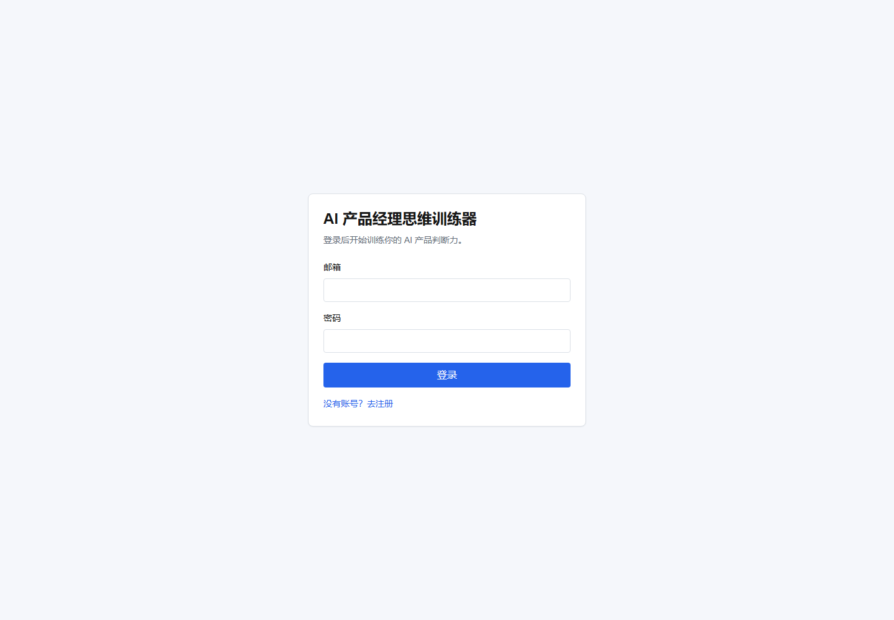
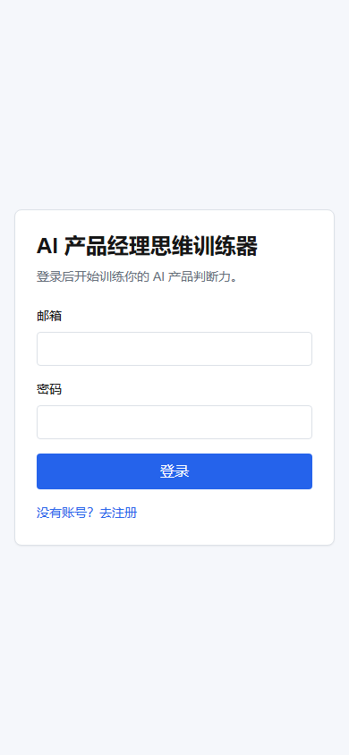
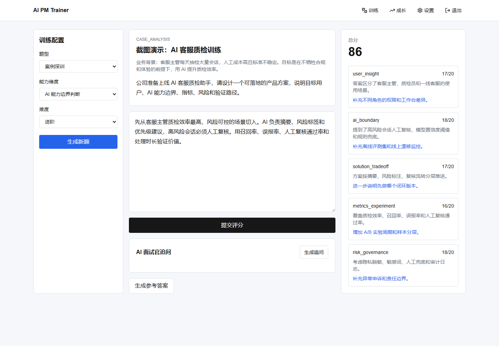
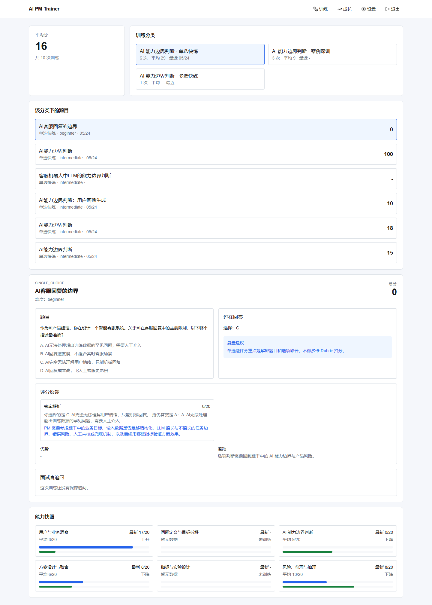

# AI 产品经理思维训练器

一个面向 AI 产品经理能力训练的响应式 Web MVP。用户可以注册登录，配置 OpenAI-compatible 模型服务，完成选择题快练和案例深训，并获得 AI 评分、面试官追问、参考答案和成长记录。

## 页面截图

| 认证页（桌面） | 认证页（移动） |
| --- | --- |
|  |  |

| 训练台 | 成长记录 |
| --- | --- |
|  |  |

登录后可以访问训练台、成长记录和设置页；这些页面受 Supabase Auth 保护，需要先完成环境变量和账号配置。

## 功能说明

- 认证与路由保护：支持邮箱注册、登录、退出，未登录用户会被重定向到认证页。
- 训练台：支持案例深训、单选快练、多选快练，可选择能力维度和难度。
- AI 出题与反馈：服务端调用 OpenAI-compatible Chat Completions API 生成题目、评分、追问和参考答案。
- 选择题评分：单选题本地即时评分，多选题支持漏选、错选和部分得分。
- 训练持久化：题目、用户答案、评分、追问和能力快照写入 Supabase Postgres，并通过 RLS 按用户隔离。
- 成长记录：聚合历史训练，展示平均分、分类训练记录、能力快照和历史详情复盘。
- AI 设置：浏览器本地保存用户自定义 `baseUrl`、`apiKey`、`model`，环境变量作为默认兜底。

## 项目结构

```text
src/app/                  Next.js App Router 页面、API routes 和 middleware
src/components/auth/      登录注册表单
src/components/training/  训练台、答题、评分、追问、参考答案组件
src/components/history/   成长记录和历史详情组件
src/components/settings/  AI Provider 设置组件
src/lib/ai/               AI client、prompt、JSON 解析和 schema 校验
src/lib/auth/             登录态守卫
src/lib/scoring/          选择题评分
src/lib/training/         训练分析、评分持久化和参考答案辅助逻辑
src/lib/supabase/         Supabase browser/server client 与公开配置解析
supabase/                 本地 Supabase 配置、数据库迁移和 seed
tests/e2e/                Playwright 冒烟测试
docs/screenshots/         README 使用的页面截图
```

## 技术栈

- Next.js App Router
- React 19
- TypeScript
- Tailwind CSS
- Supabase Auth / Postgres / RLS
- OpenAI-compatible Chat Completions API
- Vitest + Testing Library
- Playwright

## 本地运行

1. 安装依赖：

```bash
npm install
```

2. 复制环境变量：

```bash
cp .env.example .env.local
```

3. 配置 Supabase：

```dotenv
NEXT_PUBLIC_SUPABASE_URL=
NEXT_PUBLIC_SUPABASE_PUBLISHABLE_KEY=
```

旧项目如果只有 anon key，也可以继续使用 `NEXT_PUBLIC_SUPABASE_ANON_KEY`。

如果使用本地 Supabase：

```bash
supabase start
supabase db reset
```

然后把 `supabase status` 输出里的 `API URL` 和 publishable/anon key 填入 `.env.local`。

如果使用云端 Supabase：

```bash
supabase link --project-ref 你的项目 ref
supabase db push
```

同时在 Supabase Auth 的 URL Configuration 中确认：

- Site URL：本地开发用 `http://localhost:3000`，线上用你的部署域名
- Redirect URLs：加入 `http://localhost:3000/**` 和线上部署域名

4. 配置默认 AI Provider：

```dotenv
AI_BASE_URL=https://api.openai.com/v1
AI_API_KEY=
AI_MODEL=gpt-4.1-mini
```

当前实现使用 OpenAI-compatible Chat Completions 接口。DeepSeek 示例：

```dotenv
AI_BASE_URL=https://api.deepseek.com
AI_API_KEY=你的 DeepSeek API Key
AI_MODEL=deepseek-v4-flash
```

DeepSeek OpenAI 格式的 Base URL 和当前模型名可参考 [DeepSeek API Docs](https://api-docs.deepseek.com/)。

5. 启动开发服务：

```bash
npm run dev
```

打开 `http://localhost:3000`。

## Vercel 部署

在 Vercel Project Settings 中配置与 `.env.example` 对应的环境变量。Supabase Auth 的 Site URL 和 Redirect URLs 需要加入 Vercel 部署域名。

部署前建议先执行：

```bash
npm run typecheck
npm run lint
npm run test
npm run build
```

## 验证命令

```bash
npm run typecheck
npm run lint
npm run test
npm run test:e2e
npm run build
```

## 常见问题

- 登录页提示“请先配置 Supabase 登录参数”：检查 `NEXT_PUBLIC_SUPABASE_URL` 和 `NEXT_PUBLIC_SUPABASE_PUBLISHABLE_KEY`。
- 题目生成或评分失败：检查 `AI_BASE_URL`、`AI_API_KEY`、`AI_MODEL`，并确认服务商支持 `/chat/completions` 和 JSON 输出。
- 云端登录后回调异常：检查 Supabase Auth 的 Site URL 和 Redirect URLs 是否包含当前部署域名。
